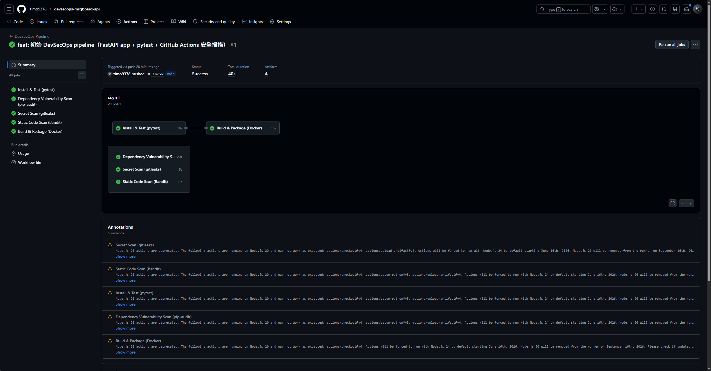
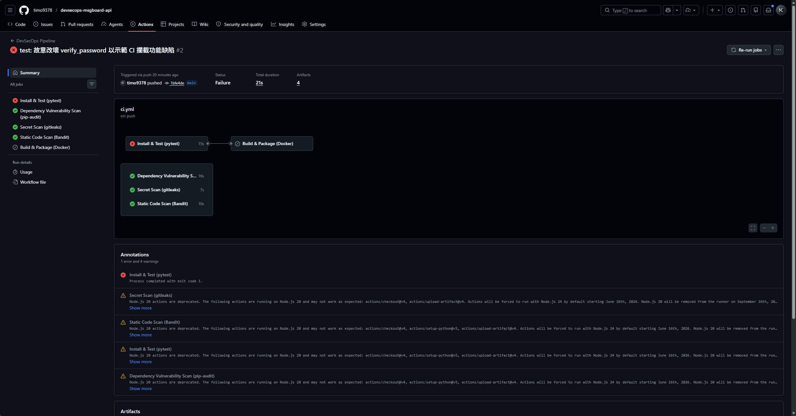
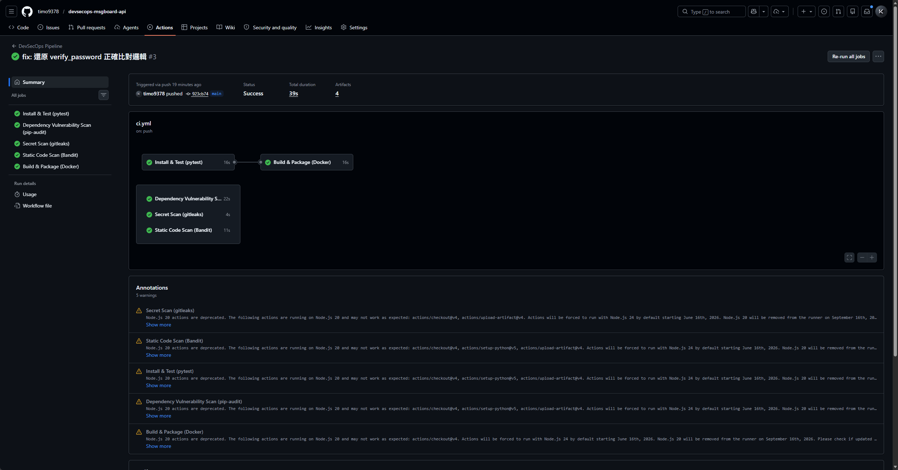
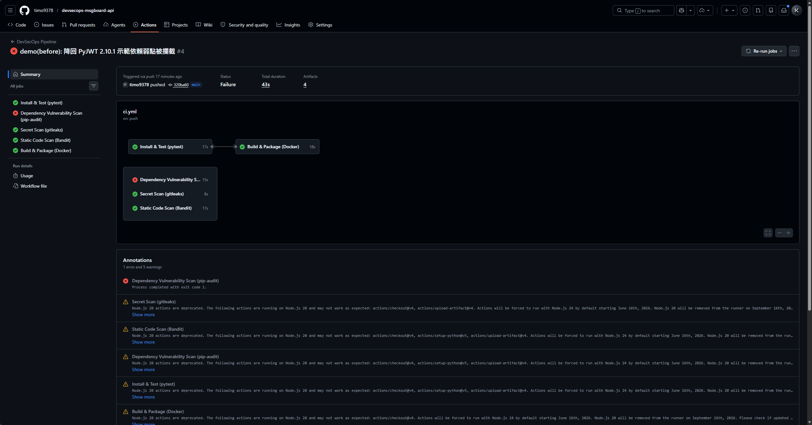

# 作業二：DevSecOps Pipeline 繳交文件

| 項目 | 內容 |
|---|---|
| 組員 | B11109007 楊泰和、B11109041 吳榮傑 |
| Public GitHub Repo | **https://github.com/timo9378/devsecops-msgboard-api** |
| 應用程式語言 | Python 3.13（FastAPI） |
| CI 平台 | GitHub Actions |

---

## 一、應用程式

一個可執行的 FastAPI 留言板 API（沿用本組 Kubernetes 作業的後端服務）：

- **語言 / 框架**：Python 3.13 + FastAPI + uvicorn
- **資料庫**：PostgreSQL（asyncpg）
- **認證**：JWT（PyJWT）+ bcrypt 密碼雜湊
- **功能**：使用者註冊 / 登入、發留言、列留言、health probe

自動化測試位於 `tests/test_auth.py`，以 pytest 驗證 `app/auth.py` 的密碼雜湊與
JWT 簽發 / 驗證（純函式、不依賴 DB），共 4 個測試案例。

---

## 二、Pipeline 設計

定義於 `.github/workflows/ci.yml`。每次 `git push` 觸發，流程如下：

```
push to GitHub
  → install dependencies   (pip install)
  → run tests              (pytest)        ← 硬性 gate
  → build / package        (docker build)  ← 硬性 gate（needs: test）
  → dependency vuln scan   (pip-audit)     ← 硬性 gate
  → secret scan            (gitleaks)      ← 硬性 gate
  → static code scan       (Bandit)        ← 產報告（report-only）
  → upload scan results    (Actions artifacts)
```

| 階段 | 工具 | 選用理由 | 發現問題時是否擋住 build |
|---|---|---|---|
| 自動化測試 | **pytest** | Python 標準測試框架 | ✅ 會 |
| 打包 | **docker build** | 多階段建置、非 root 執行，產出可部署 image | ✅ 會 |
| 依賴弱點掃描 | **pip-audit** | Python 原生、能解析傳遞依賴，且**不需 NVD API Key**（刻意避開 OWASP Dependency-Check 的 key 問題） | ✅ 會 |
| 機密掃描 | **gitleaks** | 掃描 git 內容是否含金鑰 / 密碼洩漏 | ✅ 會 |
| 靜態程式碼掃描 | **Bandit** | Python SAST，偵測 hardcoded secret 等不安全寫法 | 產報告、不擋 |

> 本 pipeline 同時包含「依賴弱點掃描」與「機密掃描 + 靜態掃描」，超出作業最低要求（擇一）。

---

## 三、測試過程紀錄

下列每一筆都對應 GitHub Actions 上一次真實的 run。

| # | 紀錄 | commit | run 連結 | 結果 |
|---|---|---|---|---|
| 1 | 成功（基線） | `31afcdd` | [run 26959181034](https://github.com/timo9378/devsecops-msgboard-api/actions/runs/26959181034) | ✅ 全綠 |
| 2 | 故意失敗（功能測試） | `1bfe4de` | [run 26959686892](https://github.com/timo9378/devsecops-msgboard-api/actions/runs/26959686892) | ❌ test 紅 |
| 3 | 修正後成功 | `923cb74` | [run 26959810880](https://github.com/timo9378/devsecops-msgboard-api/actions/runs/26959810880) | ✅ 回綠 |
| 4 | 依賴弱點（修補前） | `320ba60` | [run 26959975464](https://github.com/timo9378/devsecops-msgboard-api/actions/runs/26959975464) | ❌ 依賴掃描紅 |
| 5 | 依賴弱點（修補後） | `527e622` | [run 26960098370](https://github.com/timo9378/devsecops-msgboard-api/actions/runs/26960098370) | ✅ 回綠 |

### 3.1 成功紀錄

基線版本，五個 job 全部綠燈（測試、打包、依賴掃描、機密掃描、靜態掃描）。



### 3.2 故意失敗紀錄（功能測試）

如課堂示範：先讓測試通過，再改壞程式使測試不過。
我們把 `app/auth.py` 的 `verify_password()` 故意改成永遠回傳 `True`，
導致測試 `test_wrong_password_rejected`（驗證錯誤密碼應被拒絕）失敗。

結果：**test job 紅燈**，且 **build job 因 `needs: test` 而被 skip**——
代表 pipeline 在「打包 / 部署」之前就攔下了這個功能缺陷。



### 3.3 修正後再次成功

把 `verify_password()` 還原成正確的比對邏輯後重新 push，
test job 恢復綠燈，整條 pipeline 回綠。證明 pipeline 確實能在修正後放行。



### 3.4 套件弱點 — 修補前 / 後

**修補前**：把相依套件降回 `PyJWT==2.10.1`，該版本帶有 **7 個已知 CVE**
（PYSEC-2026-176 演算法允許清單繞過、PYSEC-2026-179 HMAC 金鑰混淆、
PYSEC-2026-120 crit header 未驗證、PYSEC-2026-175/177/178、PYSEC-2025-183）。
pip-audit 在 CI 偵測到後，**dependency-scan job 紅燈**；此時 test / build 仍為綠，
顯示依賴掃描是獨立把關的階段。



**修補後**：將套件升級為 `PyJWT==2.13.0`（**只改版號，程式碼零改動**）。
pip-audit 報告恢復乾淨、dependency-scan 回綠。


---

## 四、產生的掃描報告與掃描結果

每個階段都會把報告以 GitHub Actions **artifact** 上傳，可在對應 run 頁面下方
「Artifacts」區塊下載：

| 報告檔 | 產出階段 | 內容 / 結果 |
|---|---|---|
| `test-results.xml` | pytest | 測試結果（JUnit 格式）：基線 4 個案例全過；故意失敗版 1 個案例 fail |
| `pip-audit-report.json` | pip-audit | 相依套件已知 CVE 清單：基線乾淨；PyJWT 2.10.1 版列出 7 個 CVE 與對應 fix 版本 |
| `gitleaks-report.sarif` | gitleaks | git 內容機密洩漏掃描：無洩漏（dev 佔位字串已於 `.gitleaks.toml` 允許清單排除） |
| `bandit-report.sarif` | Bandit | Python 靜態程式碼弱點：列出 `config.py` 的 dev 預設值等可接受項目 |

### 已接受風險（已評估、暫不升級）

| CVE | 套件 | 類型 | 為何暫不升級 | 緩解措施 |
|---|---|---|---|---|
| PYSEC-2026-161 | starlette 0.49.3 | Host header 路徑混淆 | 修補版在 1.0.1，但目前 fastapi 仍鎖 `starlette <0.50`，無相容版本可升 | 本服務授權採 JWT（非以 `request.url.path` 判斷）；正式部署前面有 ingress-nginx 正規化 Host header。已於 pip-audit 以 `--ignore-vuln PYSEC-2026-161` 標記並記錄。 |

---

## 五、結語

本作業以 GitHub Actions 建立了一條完整的 DevSecOps pipeline，涵蓋
**測試、打包、依賴弱點掃描、機密掃描、靜態程式碼掃描** 五道關卡，並以三組真實紀錄
（成功 → 故意失敗 → 修正後成功）與一組套件弱點修補前後對照，
證明此 pipeline 能在程式碼合併 / 部署前，自動攔截功能缺陷與安全弱點，
協助團隊及早發現問題。
